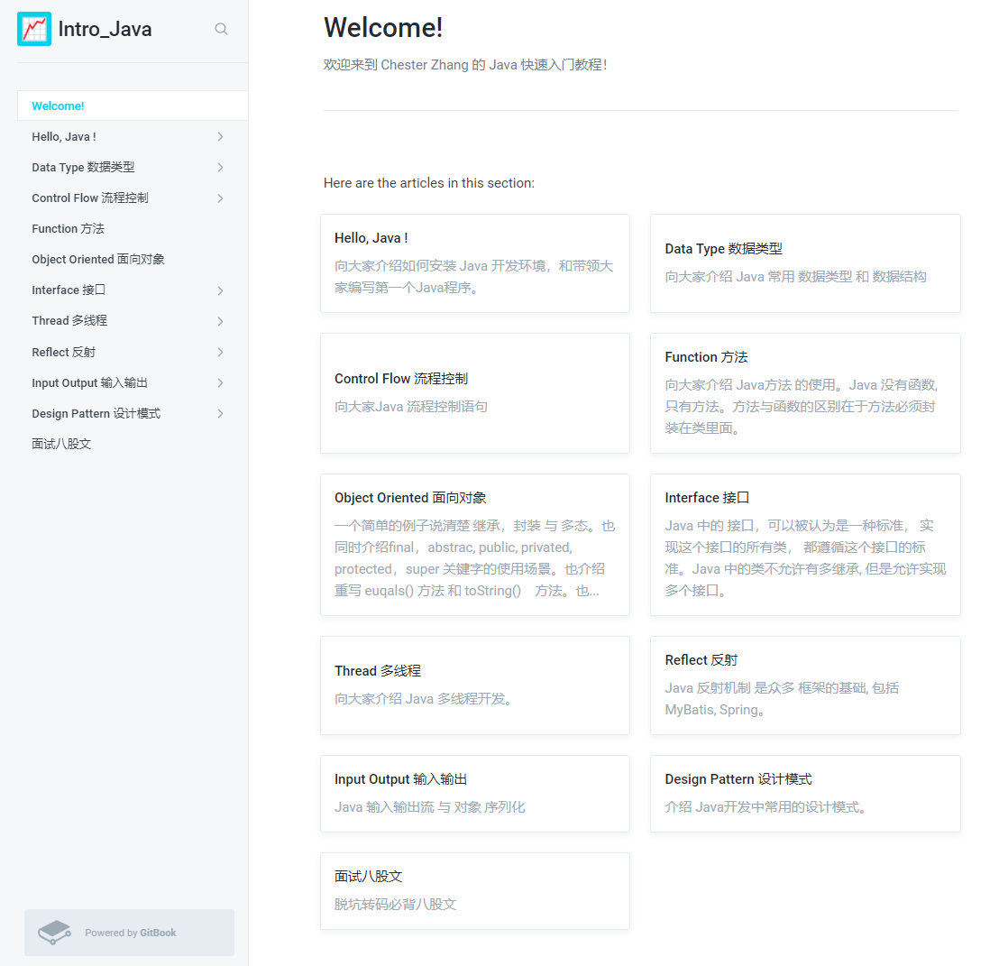

## 欢迎来到 Chester Zhang 的 Java 快速入门代码仓库
####
也欢迎访问 [我的配套 GitBook 图文教程](https://chesterzhang666.gitbook.io/intro-java/)
###

###

<table class="tg">
<thead>
  <tr>
    <th class="tg-nrix">章节</th>
    <th class="tg-nrix">说明</th>
    <th class="tg-nrix">GitBook 图文教程</th>
    <th class="tg-0lax">代码</th>
  </tr>
</thead>
<tbody>
  <tr>
    <td class="tg-nrix" rowspan="2">Hello, Java</td>
    <td class="tg-nrix">JDK + InteliJ IDEA 环境搭建</td>
    <td class="tg-nrix"><a href="https://chesterzhang666.gitbook.io/intro-java/hello-java/jdk-+-idea-huan-jing-da-jian">JDK + IntelliJ IDEA 环境搭建</a></td>
    <td class="tg-0lax">[无]</td>
  </tr>
  <tr>
    <td class="tg-nrix">InteliJ IDEA 编写第一个程序</td>
    <td class="tg-nrix"><a href="https://chesterzhang666.gitbook.io/intro-java/hello-java/hello-intellij-idea">InteliJ IDEA 编写 第一个程序</a></td>
    <td class="tg-0lax"><a href="https://github.com/chesterzhang/intro_Java/tree/zhc_dev/HelloProject">已完成</a></td>
  </tr>
  <tr>
    <td class="tg-nrix">Data Type 数据类型</td>
    <td class="tg-nrix">Data Type 数据类型</td>
    <td class="tg-nrix"><a href="https://chesterzhang666.gitbook.io/intro-java/data-type">Java 数据类型</a></td>
    <td class="tg-0lax"><a href="https://github.com/chesterzhang/intro_Java/tree/zhc_dev/DataTypeDemo">已完成</a></td>
  </tr>
  <tr>
    <td class="tg-nrix">Control Flow 流程控制</td>
    <td class="tg-nrix">流程控制语句, 条件, 循环, 选择</td>
    <td class="tg-nrix"><a href="https://chesterzhang666.gitbook.io/intro-java/control-flow">Control Flow 流程控制</a></td>
    <td class="tg-0lax"><a href="https://github.com/chesterzhang/intro_Java/tree/zhc_dev/ControlFlow/src/indi/chester/controflow">已完成</a></td>
  </tr>
  <tr>
    <td class="tg-nrix">Java 方法</td>
    <td class="tg-nrix">Java 方法的使用</td>
    <td class="tg-nrix"><a href="https://chesterzhang666.gitbook.io/intro-java/function">Java 方法</a></td>
    <td class="tg-0lax"><a href="https://github.com/chesterzhang/intro_Java/tree/zhc_dev/Function/src/indi/chester/functiondemo">已完成</a></td>
  </tr>
  <tr>
    <td class="tg-nrix">Object Oriented 面向对象</td>
    <td class="tg-nrix">一个例子讲清面向对象三大特性，与Java 类的使用。</td>
    <td class="tg-nrix"><a href="https://chesterzhang666.gitbook.io/intro-java/ji-cheng-feng-zhuang-yu-duo-tai">Object Oriented 面向对象</a></td>
    <td class="tg-0lax"><a href="https://github.com/chesterzhang/intro_Java/tree/zhc_dev/ObjectOriented/src/indi/chester/animal">已完成</a></td>
  </tr>
  <tr>
    <td class="tg-nrix" rowspan="3">Interface 接口</td>
    <td class="tg-nrix">什么是接口 </td>
    <td class="tg-nrix"><a href="https://chesterzhang666.gitbook.io/intro-java/interface-jie-kou">Interface 接口</a></td>
    <td class="tg-0lax"><a href="https://github.com/chesterzhang/intro_Java/tree/zhc_dev/Interface/src/indi/chester">已完成</a></td>
  </tr>
  <tr>
    <td class="tg-nrix">Comparable 接口用法</td>
    <td class="tg-nrix"><a href="https://chesterzhang666.gitbook.io/intro-java/interface-jie-kou/comparable">Comparable 接口</a></td>
    <td class="tg-0lax"><a href="https://github.com/chesterzhang/intro_Java/tree/zhc_dev/Interface/src/indi/chester/comparabledemo">已完成</a></td>
  </tr>
  <tr>
    <td class="tg-nrix">Comparator 接口用法</td>
    <td class="tg-nrix"><a href="https://chesterzhang666.gitbook.io/intro-java/interface-jie-kou/comparator">Comparator 接口</a></td>
    <td class="tg-0lax"><a href="https://github.com/chesterzhang/intro_Java/tree/zhc_dev/Interface/src/indi/chester/comparator">已完成</a></td>
  </tr>
  <tr>
    <td class="tg-nrix" rowspan="6">Thread 多线程基础</td>
    <td class="tg-nrix">多线程的创建</td>
    <td class="tg-nrix"><a href="https://chesterzhang666.gitbook.io/intro-java/thread">Thread 多线程</a></td>
    <td class="tg-0lax"><a href="https://github.com/chesterzhang/intro_Java/tree/zhc_dev/Thread/src/indi/chester/threadpool">已完成</a></td>
  </tr>
  <tr>
    <td class="tg-nrix">sleep 方法的使用</td>
    <td class="tg-nrix"><a href="https://chesterzhang666.gitbook.io/intro-java/thread/sleep-han-shu">sleep 方法</a></td>
    <td class="tg-0lax"><a href="https://github.com/chesterzhang/intro_Java/tree/zhc_dev/Thread/src/indi/chester/thread">已完成</a></td>
  </tr>
  <tr>
    <td class="tg-nrix">join 方法的使用</td>
    <td class="tg-nrix"><a href="https://chesterzhang666.gitbook.io/intro-java/thread/join-han-shu">join 方法</a></td>
    <td class="tg-0lax"><a href="https://github.com/chesterzhang/intro_Java/tree/zhc_dev/Thread/src/indi/chester/thread">已完成</a></td>
  </tr>
  <tr>
    <td class="tg-nrix">setPriority 方法的使用</td>
    <td class="tg-nrix"><a href="https://chesterzhang666.gitbook.io/intro-java/thread/setpriority-han-shu">setPriority 方法</a></td>
    <td class="tg-0lax"><a href="https://github.com/chesterzhang/intro_Java/tree/zhc_dev/Thread/src/indi/chester/thread">已完成</a></td>
  </tr>
  <tr>
    <td class="tg-nrix">synchronization关键字与线程同步</td>
    <td class="tg-nrix"><a href="https://chesterzhang666.gitbook.io/intro-java/thread/synchronization-xian-cheng-tong-bu">synchronization 线程同步</a></td>
    <td class="tg-0lax"><a href="https://github.com/chesterzhang/intro_Java/tree/zhc_dev/Thread/src/indi/chester/synchronization">已完成</a></td>
  </tr>
  <tr>
    <td class="tg-nrix">wait,notifyAll方法与线程间通信</td>
    <td class="tg-nrix"><a href="https://chesterzhang666.gitbook.io/intro-java/thread/wait-notifyall-xian-cheng-jian-tong-xin">wait notifyAll 线程间通信</a></td>
    <td class="tg-0lax"><a href="https://github.com/chesterzhang/intro_Java/tree/zhc_dev/Thread/src/indi/chester/producer_consumer">已完成</a></td>
  </tr>
  <tr>
    <td class="tg-nrix" rowspan="3">ThreadPool 线程池</td>
    <td class="tg-nrix">线程池概念</td>
    <td class="tg-nrix"><a href="https://chesterzhang666.gitbook.io/intro-java/threadpool-xian-cheng-chi">已完成</a></td>
    <td class="tg-0lax">无</td>
  </tr>
  <tr>
    <td class="tg-nrix">自动创建线程池</td>
    <td class="tg-nrix"><a href="https://chesterzhang666.gitbook.io/intro-java/threadpool-xian-cheng-chi/zi-dong-chuang-jian-xian-cheng-chi">已完成</a></td>
    <td class="tg-0lax"><a href="https://github.com/chesterzhang/intro_Java/tree/zhc_dev/Thread/src/indi/chester/threadpool">已完成</a></td>
  </tr>
  <tr>
    <td class="tg-nrix">关闭线程池</td>
    <td class="tg-nrix">待完成</td>
    <td class="tg-0lax"><a href="https://github.com/chesterzhang/intro_Java/tree/zhc_dev/Thread/src/indi/chester/threadpool">已完成</a></td>
  </tr>
  <tr>
    <td class="tg-nrix">ThreadLocal</td>
    <td class="tg-nrix">什么是ThreadLocal, ThreadLocal的 应用场景</td>
    <td class="tg-nrix"><a href="https://chesterzhang666.gitbook.io/intro-java/threadlocal">已完成</a></td>
    <td class="tg-0lax"><a href="https://github.com/chesterzhang/intro_Java/tree/zhc_dev/Thread/src/indi/chester/threadlocal">已完成</a></td>
  </tr>
  <tr>
    <td class="tg-nrix" rowspan="6"> Reflect 反射</td>
    <td class="tg-nrix">什么是反射</td>
    <td class="tg-nrix"><a href="https://chesterzhang666.gitbook.io/intro-java/refelct-fan-she">Reflect 反射</a></td>
    <td class="tg-0lax"><a href="https://github.com/chesterzhang/intro_Java/tree/zhc_dev/Reflect/src/indi/chester/reflectdemo">已完成</a></td>
  </tr>
  <tr>
    <td class="tg-nrix">什么是Class类</td>
    <td class="tg-nrix"><a href="https://chesterzhang666.gitbook.io/intro-java/refelct-fan-she/class-lei">Class类</a></td>
    <td class="tg-0lax">[无]</td>
  </tr>
  <tr>
    <td class="tg-nrix">Class.forName 与 classObj.newInstance 方法</td>
    <td class="tg-nrix"><a href="https://chesterzhang666.gitbook.io/intro-java/refelct-fan-she/class.forname-yu-classobj.newinstance-fang-fa">Class.forName 与 classObj.newInstance 方法</a></td>
    <td class="tg-0lax"><a href="https://github.com/chesterzhang/intro_Java/tree/zhc_dev/Reflect/src/indi/chester/classdemo">已完成</a></td>
  </tr>
  <tr>
    <td class="tg-nrix">classObj.getConstructor 方法</td>
    <td class="tg-nrix"><a href="https://chesterzhang666.gitbook.io/intro-java/refelct-fan-she/class.getconstructor-fang-fa">classObj.getConstructor 方法</a></td>
    <td class="tg-0lax"><a href="https://github.com/chesterzhang/intro_Java/tree/zhc_dev/Reflect/src/indi/chester/constructordemo">已完成</a></td>
  </tr>
  <tr>
    <td class="tg-nrix">classObj.getMethod 方法</td>
    <td class="tg-nrix"><a href="https://chesterzhang666.gitbook.io/intro-java/refelct-fan-she/classobj.getmethod-fang-fa">classObj.getMethod 方法</a></td>
    <td class="tg-0lax"><a href="https://github.com/chesterzhang/intro_Java/tree/zhc_dev/Reflect/src/indi/chester/methoddemo">已完成</a></td>
  </tr>
  <tr>
    <td class="tg-nrix">classObj.getField 方法</td>
    <td class="tg-nrix"><a href="https://chesterzhang666.gitbook.io/intro-java/refelct-fan-she/classobj.getfield-fang-fa">classObj.getField 方法</a></td>
    <td class="tg-0lax"><a href="https://github.com/chesterzhang/intro_Java/tree/zhc_dev/Reflect/src/indi/chester/fileddemo">已完成</a></td>
  </tr>
  <tr>
    <td class="tg-nrix" rowspan="2">InputOutput 输入输出</td>
    <td class="tg-nrix">Java 输入输出流 分类</td>
    <td class="tg-nrix"><a href="https://chesterzhang666.gitbook.io/intro-java/input-output-shu-ru-shu-chu">Java 输入输出流</a></td>
    <td class="tg-0lax">无</td>
  </tr>
  <tr>
    <td class="tg-nrix">对象 序列化 与 反序列化</td>
    <td class="tg-nrix"><a href="https://chesterzhang666.gitbook.io/intro-java/input-output-shu-ru-shu-chu/serialization-xu-lie-hua">Serialization 序列化</a></td>
    <td class="tg-0lax"><a href="https://github.com/chesterzhang/intro_Java/tree/zhc_dev/InputOutput">已完成</a></td>
  </tr>
  <tr>
    <td class="tg-nrix" rowspan="2">Design Pattern 设计模式</td>
    <td class="tg-nrix"> Singleton 单例模式</td>
    <td class="tg-nrix"><a href="https://chesterzhang666.gitbook.io/intro-java/design-pattern-she-ji-mo-shi/singleton-dan-li-mo-shi">Singleton 单例模式</a></td>
    <td class="tg-0lax"><a href="https://github.com/chesterzhang/intro_Java/tree/zhc_dev/DesignPattern/src/indi/chester/singleton">已完成</a></td>
  </tr>
  <tr>
    <td class="tg-nrix"> Factory 工厂模式</td>
    <td class="tg-nrix"><a href="https://chesterzhang666.gitbook.io/intro-java/design-pattern-she-ji-mo-shi/factory-gong-chang-mo-shi">Factory 工厂模式</a></td>
    <td class="tg-0lax"><a href="https://github.com/chesterzhang/intro_Java/tree/zhc_dev/DesignPattern/src/indi/chester/factory">已完成</a></td>
  </tr>
  <tr>
    <td class="tg-nrix" rowspan="3">Maven 项目管理</td>
    <td class="tg-nrix">Maven 的安装与配置, Maven 与 IDEA 集成</td>
    <td class="tg-nrix"><a href="https://chesterzhang666.gitbook.io/intro-java/maven/maven-an-zhuang-yu-pei-zhi" target="_blank" rel="noopener noreferrer">已完成</a></td>
    <td class="tg-0lax">无</td>
  </tr>
  <tr>
    <td class="tg-nrix">Maven 创建 Java 项目</td>
    <td class="tg-nrix"><a href="https://chesterzhang666.gitbook.io/intro-java/maven/maven-chuang-jian-java-xiang-mu" target="_blank" rel="noopener noreferrer">已完成</a></td>
    <td class="tg-0lax"><a href="https://github.com/chesterzhang/intro_Java/tree/zhc_dev/Maven0">已完成</a></td>
  </tr>
  <tr>
    <td class="tg-nrix">Maven  创建 Java web 项目</td>
    <td class="tg-nrix"><a href="https://chesterzhang666.gitbook.io/intro-java/maven/maven-chuang-jian-java-web-xiang-mu" target="_blank" rel="noopener noreferrer">已完成</a></td>
    <td class="tg-0lax"><a href="https://github.com/chesterzhang/intro_Java/tree/zhc_dev/Maven1">已完成</a></td>
  </tr>
  <tr>
    <td class="tg-nrix">JUnit 测试工具</td>
    <td class="tg-nrix">什么是 JUnit, JUnit 的使用</td>
    <td class="tg-nrix">未完成</td>
    <td class="tg-7h26"><a href="https://github.com/chesterzhang/intro_Java/tree/zhc_dev/JUnit" target="_blank" rel="noopener noreferrer">已完成</a></td>
  </tr>
  <tr>
    <td class="tg-nrix">MyBatis 数据访问层框架</td>
    <td class="tg-nrix">MyBatis 工作流程</td>
    <td class="tg-nrix"><a href="https://chesterzhang666.gitbook.io/intro-java/mybatis">MyBatis 工作流程</a></td>
    <td class="tg-0lax">无</td>
  </tr>
  <tr>
    <td class="tg-nrix">面试八股文</td>
    <td class="tg-nrix">Java 基础 面试八股文, 常见问题 和 参考答案</td>
    <td class="tg-nrix"><a href="https://chesterzhang666.gitbook.io/intro-java/mian-shi-ba-gu-wen">面试八股文[已完成]</a></td>
    <td class="tg-0lax">无</td>
  </tr>
</tbody>
</table>